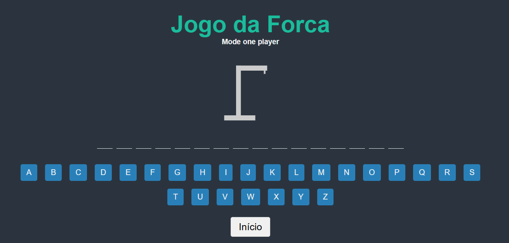

# HANGMAN GAME



This project is a Hangman game developed with Vue.js 3 using Vite. The objective of the game is to guess the word before the stick figure is hanged!

## Access the Game

You can access the game directly via GitHub Pages: [Hangman Game on GitHub Pages](https://leonardocigalotti.github.io/hangman/)

## Recommended IDE Setup

For the best development experience, use [VSCode](https://code.visualstudio.com/) with the [Volar](https://marketplace.visualstudio.com/items?itemName=Vue.volar) extension (remember to disable Vetur).

## Customize Settings

See the [Vite configuration reference](https://vitejs.dev/config/) for more information on how to customize the project.

## Project Setup

### Install Dependencies

Run the command below to install the project's dependencies:

```sh
npm install
```

### Compile and Run in Development Mode

To start the development server with hot-reload, execute:

```sh
npm run dev
```

### Compile and Minify for Production

To generate optimized files for production:

```sh
npm run build
```