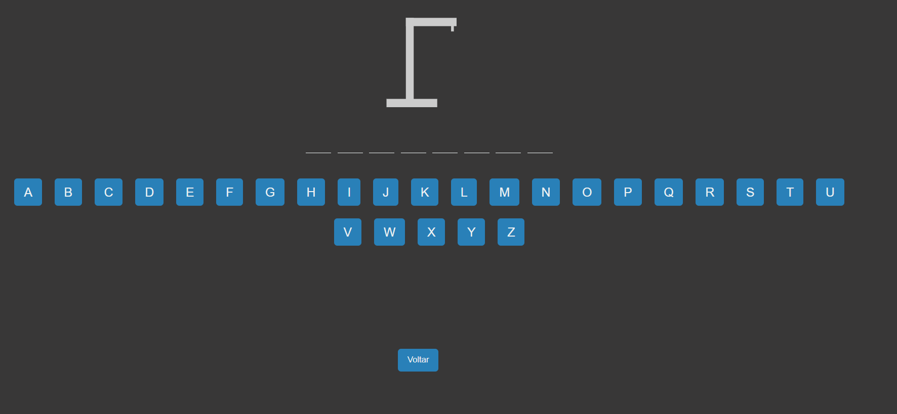

# Jogo da Forca

um jogo da forca desenvolvido em React + Typescript, com interface simples e responsiva

# Preview



# Funcionalidades

- Escolha aleatória de palavras
- Sistema de tentativas limitadas
- Feedback visual de acertos e erros
- Modo em inglês e português
- Modo escuro e claro

# Tecnologia

- React
- Typescript
- CSS

# Como executar

```bash
# Clone o repositório
git clone https://github.com/LeonardoCigalotti/hangman.git

# Acesse a pasta
cd hangman

# Instale as dependências
npm install

# Rode o projeto
npm run dev
